<!-- Animated contribution graph: real jrile018 data, refreshed daily by
     .github/workflows/update-profile-art.yml. -->

<h3><code>john@github ~ $ ./contributions.sh</code></h3>

 
 

<!-- Both SVGs are 840x880, so equal widths produce equal heights.
     Portrait: python scripts/prep_photo.py source-photo.png source-prepped.png
               && python scripts/make_ascii_svg.py source-prepped.png john-ascii.svg
     Stats:    python scripts/render_stats_svg.py -->

<h3><code>john@github ~ $ whoami</code></h3>

<table>
<tr>
<td valign="top"></td>
<td valign="top"></td>
</tr>
</table>

 
 

<h3><code>john@github ~ $ ./links.sh</code></h3>

<b>Computer Engineering + Mathematics @ the University of Florida</b>

---

<h1 align="center">John Riley</h1>

  Building low-latency systems, quantitative models, and agentic software.

  <a href="#featured-project">Lattice</a> ·
  <a href="#open-source">Open source</a> ·
  <a href="https://github.com/jrile018?tab=repositories">All repositories</a>

## Current focus

- **Market infrastructure:** deterministic data paths, order books, lock-free concurrency, and measurable latency.
- **Quantitative research:** market microstructure, geometric relationships, price impact, and alternative data.
- **Agentic systems:** reliable, inspectable workflows for data-heavy applications.

## Featured project

### [Lattice](https://github.com/jrile018/Lattice)

**Geometric market manifold for statistical arbitrage.**

A cross-platform C++ research instrument for finding candidate equity
dislocations through geometric relationship modeling, backed by 379 tests
across Linux, AddressSanitizer, and Windows.

`C++` · `CMake` · `Apache Arrow` · `Quantitative research`

## Open source

- [**trade-ngin**](https://github.com/AlgoGators/trade-ngin) — Contributed
  portfolio architecture, performance benchmarking, live-trading reliability,
  and CI/security hardening to a C++20 quantitative trading engine. 
  Selected merged work: [dual-portfolio schema #54](https://github.com/AlgoGators/trade-ngin/pull/54) ·
  [benchmark harness #59](https://github.com/AlgoGators/trade-ngin/pull/59) ·
  [CI reliability #72](https://github.com/AlgoGators/trade-ngin/pull/72)

- [**AlgoLens**](https://github.com/AlgoGators/AlgoLens) — Built and hardened
  strategy, portfolio, and risk-analytics workflows across a React/Flask
  investment platform. 
  Selected merged work: [strategy registry and portfolio services #13](https://github.com/AlgoGators/AlgoLens/pull/13) ·
  [StrategyBuilder refactor #14](https://github.com/AlgoGators/AlgoLens/pull/14) ·
  [risk metrics #81](https://github.com/AlgoGators/AlgoLens/pull/81)

## How I build

I care about deterministic behavior, reproducible research, explicit
assumptions, and performance claims backed by measurements. The most
interesting projects are the ones where systems engineering and empirical
research meet.

## Languages and tools

**Systems:** Rust, C++, CMake 
**Research and data:** Python, pandas, NumPy, SciPy 
**Product:** TypeScript, React, Next.js, Flask, Docker, PostgreSQL

---

  <a href="https://github.com/jrile018?tab=repositories">Explore more of my work →</a>

